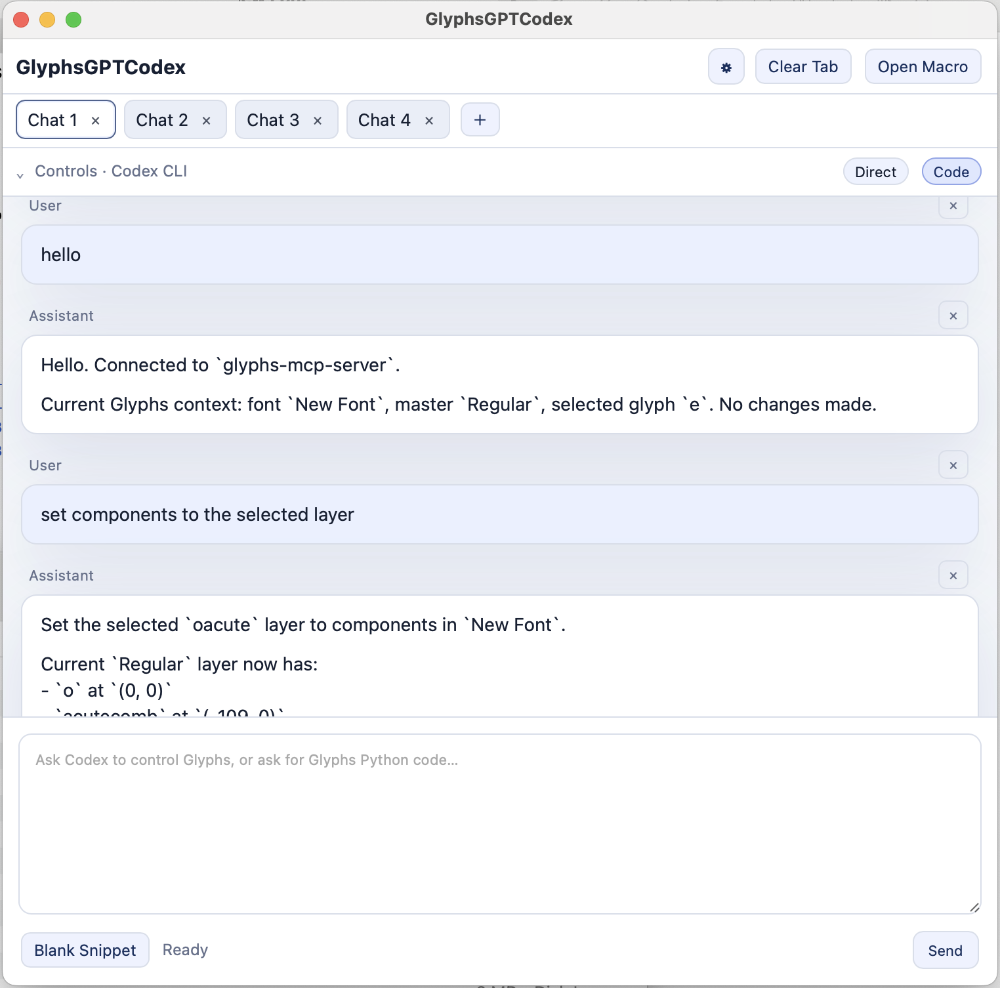

# GlyphsGPT with Chat

An AI control panel for **Glyphs 3**.

`GlyphsGPT with Chat.py` is designed to help you **control Glyphs with AI**, either by using **MCP-based workflows** or by generating **Glyphs Python** code when direct control is not available or not ideal.

It can be used as:

- an AI control surface for Glyphs
- an MCP-enabled interface for Glyphs workflows
- a generator for Glyphs Python code
- a conversational alternative to the Macro Panel

---

## Screenshot



---

## What this script is for

The main goal of this script is to make **AI-driven work inside Glyphs** faster and more practical.

In actual use, that usually means one of these two workflows:

### 1. Direct AI control of Glyphs
In **Direct mode**, the assistant can be used as a control interface for Glyphs-oriented workflows.

This is the mode intended for:
- checking the current state of the font
- inspecting glyph-related information
- using MCP-based tool workflows
- interacting with Glyphs more directly through AI

### 2. Glyphs Python generation
In **Code mode**, the assistant focuses on generating **Glyphs Python** code.

This is useful when:
- direct tool-based control is unavailable
- you want a script instead of a direct action
- you want to inspect or edit the generated logic yourself
- you prefer a workflow closer to the Macro Panel

In practice, `GlyphsGPT with Chat.py` sits somewhere between:
- an AI control panel for Glyphs
- an MCP-aware assistant
- a Glyphs Python generator
- a more conversational replacement for the Macro Panel

---

## How it works

GlyphsGPT with Chat supports two main approaches:

### MCP-based control
For AI workflows that directly interact with Glyphs state and tools, this project is intended to work with:

- **Glyphs-mcp** by thierryc  
  https://github.com/thierryc/Glyphs-mcp

This is the recommended setup for **Direct mode** when the goal is actual AI-assisted control of Glyphs.

### Code generation
When direct control is not available, or when you want explicit code output, **Code mode** generates **Glyphs Python** that you can review, modify, and run yourself.

---

## Requirements

- **Glyphs 3**
- Python environment provided by Glyphs
- `GlyphsGPT with Chat.py`

Depending on your setup, you will also need one or more of the following:

- **Glyphs-mcp** for practical Direct mode control workflows
- **Codex CLI**
- **OpenAI API key**
- **Anthropic API key**
- **a local OpenAI-compatible server** such as LM Studio

---

## Installation

### 1. Install the script

Copy `GlyphsGPT with Chat.py` into your Glyphs Scripts folder.

Then:

1. Open **Glyphs 3**
2. Launch the script from the **Scripts** menu

### 2. Install Glyphs MCP for Direct mode

For real Glyphs control in **Direct mode**, install:

- **Glyphs-mcp**  
  https://github.com/thierryc/Glyphs-mcp

Without MCP, Direct mode may still behave like a normal assistant chat depending on the provider, but it will not provide the intended level of direct Glyphs control.

### 3. Configure a provider

Open the **Tab Settings** panel and configure the provider you want to use.

---

## Modes

## Direct mode

**Direct mode** is for AI-assisted control workflows.

This is the mode to use when you want the assistant to behave more like an AI operator for Glyphs rather than a pure code generator.

For the intended workflow, **Glyphs-mcp should be installed and available**.

Typical uses:
- ask about the current font state
- inspect Glyphs-related context
- perform MCP-oriented workflows
- use the assistant as a control surface inside Glyphs

## Code mode

**Code mode** is for generating **Glyphs Python**.

This mode is useful even without MCP, because it can still produce code that you can run manually or adapt.

Typical uses:
- generate Glyphs scripts
- draft automation helpers
- prototype code quickly
- use the tool like a smarter Macro Panel

---

## Providers

GlyphsGPT with Chat supports multiple providers.

### Codex CLI
Use this for Codex-style local workflows.

### OpenAI API
Use this with your OpenAI API key.

Typical configuration:
- **Provider**: `OpenAI API`
- **API Base**: `https://api.openai.com/v1`

### Claude API
Use this with your Anthropic API key.

Typical configuration:
- **Provider**: `Claude API`
- **API Base**: `https://api.anthropic.com/v1`

### Local / OpenAI-compatible
Use this for local or self-hosted servers that expose an OpenAI-compatible API.

Typical examples:
- LM Studio
- local model gateways
- compatible proxy endpoints

Typical configuration:
- **Provider**: `Local / OpenAI-compatible`
- **API Base**: for example `http://127.0.0.1:1234/v1`

---

## Recommended local LLMs

Recommended local models:

- **gpt-oss-20b**
- **gpt-oss-120b**

`gpt-oss-20b` is easier to run locally.  
`gpt-oss-120b` is more capable when hardware allows it.

---

## Basic workflow

A typical workflow looks like this:

1. Open GlyphsGPT with Chat inside Glyphs
2. Choose a tab
3. Select a provider
4. Configure model and connection settings
5. Choose **Direct** or **Code**
6. Send a prompt
7. Review the result
8. Iterate

In practice:

- use **Direct mode** for AI-assisted control workflows
- use **Code mode** for explicit Glyphs Python generation
- use it as a more conversational alternative to the Macro Panel

---

## Session behavior

- settings are stored **per tab**
- new tabs inherit the current tab configuration
- local state is saved for convenience

This makes it easy to separate:
- different providers
- different models
- Direct mode vs Code mode
- different projects or experiments

---

## Local state

This script stores local state outside the script file itself.

That means the script file can usually be shared safely, while runtime settings such as API keys and local state are stored separately on your machine.

**Do not commit your local state file to Git.**

---

## Security note

Before publishing this script, make sure you are **not uploading local state or secret files**.

Recommended checks before pushing to GitHub:

- verify that API keys are **not** hardcoded
- verify that local state files are **not** tracked
- verify that personal paths or temporary files are excluded

Example `.gitignore`:

```gitignore
.DS_Store
*.tmp
GlyphsGPT with Chat_state.json
